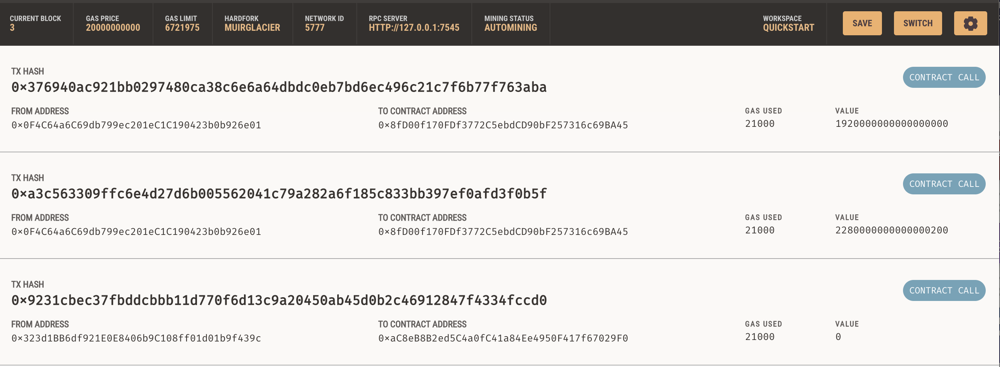
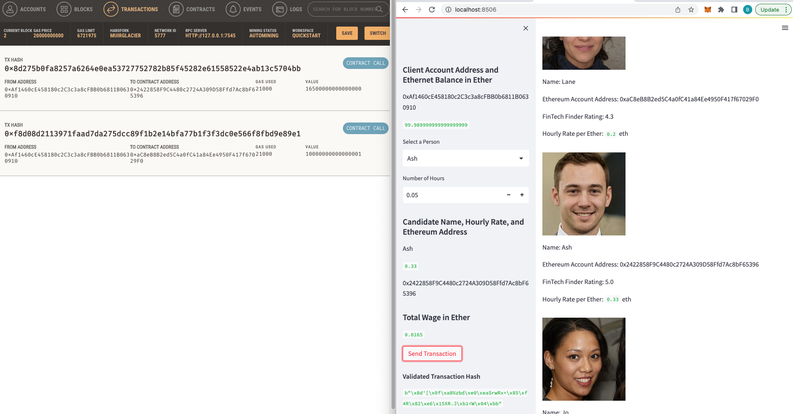
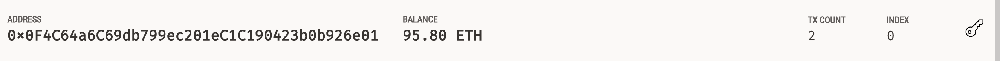
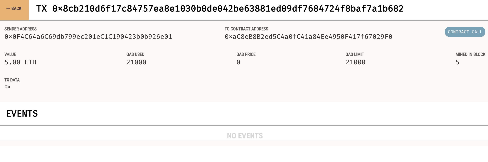

# FinTech_Finder
Handy application to hire a FinTech professional!
## Required Installs:
streamlit, dataclass, typing(Any, List), web3
## Ganache Images:
### Ganache Transactions:

### Ganache Balance:

### Ganache History:

## Instructions:
Using terminal navigate to the folder containing fintech_finder.py and enter "streamlit run fintech_finder.py", this will open a seperate browser window where you will be able to hire a FinTech professional. 
### Created By:
Ben Spiegel